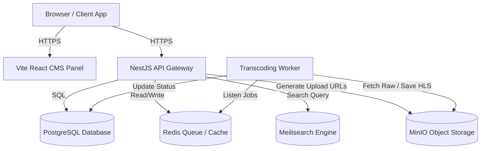

# Kaler — OTT Video Streaming Platform

A production-ready, feature-rich Over-The-Top (OTT) video streaming platform. It features adaptive HLS transcoding, user subscription management, billing, notifications, search indexing, and a full administrative CMS panel.

---

## 🏗️ Architecture Overview

The platform is designed around a microservices/modular architecture consisting of a NestJS backend, a Vite React administrative dashboard, an autonomous transcoding worker, and local containerized infrastructure services.



---

## 📁 Repository Layout

```
kaler/
├── ott-platform/
│   ├── backend/           # NestJS REST API Server
│   ├── cms-frontend/      # React (Vite, TailwindCSS) Admin Dashboard
│   ├── worker/            # Transcoding & HLS Video Processing Service
│   ├── docker-compose.yml # PostgreSQL, Redis, MinIO, Meilisearch
│   ├── devstart.sh        # ⚡ One-command dev launcher (infra + all services)
│   └── SETUP.md           # Detailed VPS & Deployment Guidelines
├── android/               # Native Android Client Application
└── README.md              # Project Workspace Documentation (This File)
```

---

## 🚀 Environment Phases Matrix

The table below contrasts the configuration, commands, and infrastructure components used in the **Development** versus **Production** phases:

| Parameter | 🛠️ Development Phase (Local / Codespaces) | 🌐 Production Phase (VPS / Cloud Hosting) |
|---|---|---|
| **NODE_ENV** | `development` | `production` |
| **Backend API** | `npm run start:dev` (Watch mode, NestJS port `3000`) | `npm run build` followed by PM2 / Docker container execution |
| **CMS Panel** | `npm run dev` (Vite dev server, port `5174`) | `npm run build` serving static assets via Nginx with compression |
| **Video Worker** | `npm run start:dev` (Watch mode) | `npm run build` followed by PM2 / node process on a high-CPU instance |
| **Object Storage** | Local MinIO Container (S3-compatible, port `9000`) | Cloudflare R2 / AWS S3 Bucket |
| **Media Assets CDN** | Local URL: `http://localhost:9000/ott-media` | Custom CDN subdomain: `https://cdn.yourdomain.com` |
| **Database** | Local PostgreSQL Container (`localhost:5432`) | Production Database (e.g. AWS RDS or highly available PostgreSQL VPS) |
| **Queue / Cache** | Local Redis Container (`localhost:6379`) | Managed Redis cluster with persistent storage enabled |
| **Search Engine** | Local Meilisearch Container (`localhost:7700`) | Production Meilisearch instance with cluster search keys |
| **SSL / TLS** | HTTP (or HTTP loopback behind Codespace HTTPS proxy) | Enforced HTTPS (Nginx reverse proxy + SSL certificates via Let's Encrypt) |
| **API Credentials** | Sandbox/Mock keys (Razorpay, Firebase mock mode) | Production/Live credentials (Razorpay Live, FCM private key files) |

---

## ⚡ Local Development Setup

### Prerequisites
- **Node.js** v18+ — [download](https://nodejs.org)
- **Docker & Docker Compose** — for containerised infrastructure
- **FFmpeg** — required by the transcoding worker

---

### 🟢 Quick Start — One Command

The [`devstart.sh`](./ott-platform/devstart.sh) script starts the **entire development environment** in a single terminal:

```bash
cd ott-platform
./devstart.sh
```

What it does, in order:

| Step | Action | URL / Port |
|------|--------|------------|
| 1 | Starts Docker infrastructure (Postgres, Redis, Meilisearch, MinIO) | see below |
| 2 | Waits for each service to become ready | — |
| 3 | Installs `node_modules` if missing (all three packages) | — |
| 4 | Launches **NestJS API** in watch mode | `http://localhost:3000` |
| 5 | Launches **Vite CMS Frontend** in watch mode | `http://localhost:5173` |
| 6 | Launches **FFmpeg Transcoding Worker** in watch mode | background |

**Infrastructure service URLs (when running):**

| Service | URL | Credentials |
|---------|-----|-------------|
| MinIO Console | `http://localhost:9001` | `minio_admin` / `minio_password_123` |
| MinIO S3 API | `http://localhost:9000` | — |
| Meilisearch | `http://localhost:7700` | — |
| PostgreSQL | `localhost:5432` | see `.env` |
| Redis | `localhost:6379` | see `.env` |

**Available flags:**

```bash
./devstart.sh --no-infra    # Skip Docker startup (infrastructure already running)
./devstart.sh --no-worker   # Skip the FFmpeg transcoding worker
./devstart.sh --help        # Show usage
```

**Live logs** are streamed to the terminal with color-coded prefixes and also written to:
```
ott-platform/.dev-logs/backend.log
ott-platform/.dev-logs/frontend.log
ott-platform/.dev-logs/worker.log
```

Press **Ctrl+C** to gracefully stop all services and Docker containers.

---

### 🔧 Manual Step-by-Step Setup (alternative)

If you prefer to run services individually:

**1. Start infrastructure:**
```bash
cd ott-platform
docker compose up -d postgres redis meilisearch minio minio-init
```
*MinIO bucket initialization runs automatically via `minio-init`.*

**2. Launch NestJS Backend API:**
```bash
cd ott-platform/backend
npm install
npm run start:dev   # watch mode → :3000
```

**3. Launch Transcoding Worker:**
```bash
cd ott-platform/worker
npm install
npm run start:dev   # ts-node watch mode
```

**4. Launch CMS Admin Panel:**
```bash
cd ott-platform/cms-frontend
npm install
npm run dev         # Vite dev server → :5173
```

---

## ⚙️ GitHub Codespaces Configuration

If running within GitHub Codespaces, secure S3 presigned URL uploads from the browser require specific port configurations:

1. **Port Attributes**: Port `9000` (MinIO API) must be configured to automatically forward and be visible **publicly** to allow HTTPS uploads from the client browser without OAuth blockage.
   *This has been configured programmatically inside the workspace settings at [settings.json](file:///.vscode/settings.json).*
2. **Environment File Configuration**: Ensure the following values are set in `backend/.env` and `worker/.env` to reference the public codespace endpoint:
   ```env
   CF_R2_ENDPOINT=https://<codespace-name>-9000.app.github.dev
   CF_R2_PUBLIC_URL=https://<codespace-name>-9000.app.github.dev/ott-media
   ```

---

## 🎬 Managing TV Series & Episodes

The administrative workflow handles TV Series structure dynamically:

1. **TV Series Actions**: In the **Series** view, rather than uploading a single video file, administrators can click the **Manage Episodes** (`Tv` icon) row action.
2. **Seasons management**: Create and list seasons (e.g. Season 1, Season 2) inside the series detail tab view.
3. **Episode management**: Within a season, add, edit, and delete episodes (specifying episode number, title, description, duration, and premium status).
4. **Video Uploads**: Select an episode and click **Upload Video** to launch the multipart video chunk uploader. This initiates the transcode worker and feeds live queue statuses to the dashboard.